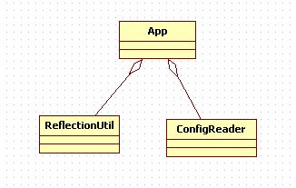
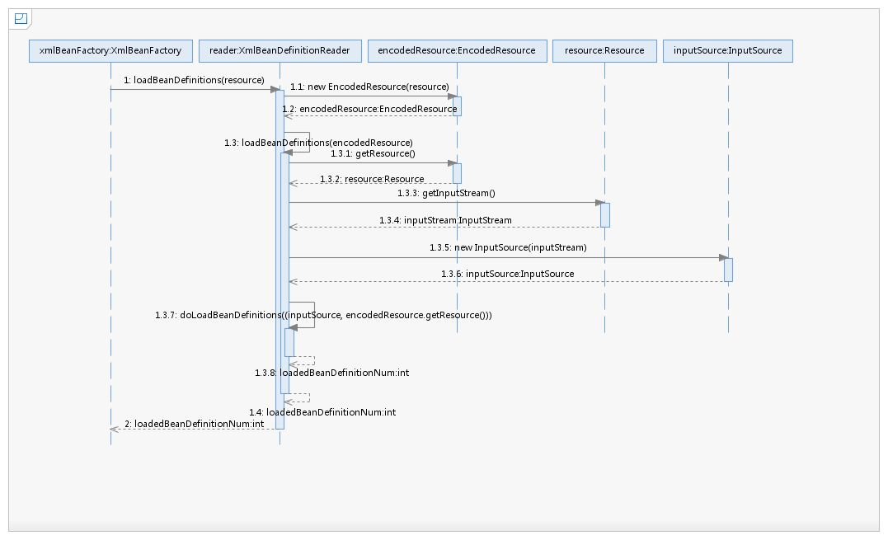
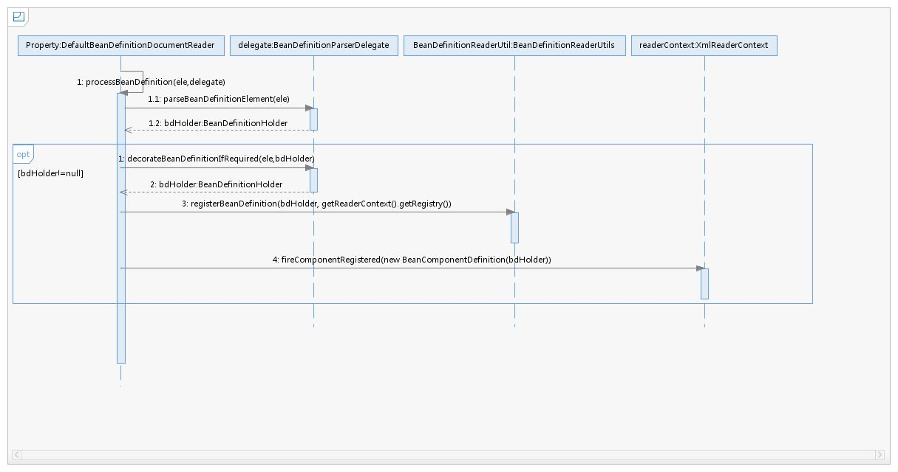

## 容器的基本实现

### 容器的基本用法

先来一个bean

```java
public class MyTestBean {
     private String testStr = "testStr";

     public String getTestStr() {
         return testStr;
     }

     public void setTestStr(String testStr) {
         this.testStr = testStr;
     }

}
```

只是一个POJO，下面是配置文件

~~~xml
<?xml version="1.0" encoding="UTF-8"?>
<beans xmlns="http://www.springframework.org/schema/beans"
    xmlns:xsi="http://www.w3.org/2001/XMLSchema-instance"
    xmlns:util="http://www.springframework.org/schema/util"
    xsi:schemaLocation="
        http://www.springframework.org/schema/beans https://www.springframework.org/schema/beans/spring-beans.xsd
        http://www.springframework.org/schema/util https://www.springframework.org/schema/util/spring-util.xsd">

     <bean id="myTestBean" class="bean.MyTestBean"/>

</beans>

~~~

测试

~~~java
@SuppressWarnings("deprecation")
public class BeanFactoryTest {

     @Test
     public void testSimpleLoad(){
             BeanFactory    bf = new XmlBeanFactory(new ClassPathResource("beanFactoryTest.xml"));
             MyTestBean bean=(MyTestBean) bf.getBean("myTestBean");
             assertEquals("testStr",bean.getTestStr());
     }
}
~~~

> 目前为止(2020/7/25 下午7:22:20)，XmlBeanFactory已经不再推荐使用。
>
> 可以用ClassPathXmlApplicationContext

~~~java
	public void testSimpleLoad(){
		ApplicationContext applicationContext = new ClassPathXmlApplicationContext("charpter02.xml");
		System.out.println(applicationContext.getBean("myTestBean"));
	}
~~~

梳理一下，Spring完成这些操作至少需要三个类，一个App用于串联所有逻辑，一个ConfigReader用于读取XML文件，还有一个ReflectionUtil用于将从XML读取出来的类进行反射实例化。



### Spring结构组成

跟着书本原本的代码进行解析。

### 配置文件封装

Spring配置文件读取通过ClassPathResource进行封装。

Spring对其内部使用到的资源实现了自己的抽象结构：Resource接口封装底层资源。


InputStreamSource封装任何能返回InputStream的类

~~~java
public interface InputStreamSource {

	InputStream getInputStream() throws IOException;

}
~~~

比如File、Classpath下的资源和Byte Array等。

Resource接口抽象了所有Spring内部使用到的底层资源：File、URL、Classpath等。

Resource接口提供了不同资源到URL、URI、File类型的转换，以及获取lastModified属性、文件名（不带路径信息的文件名，getFilename()）的方法。为了便于操作，Resource还提供了基于当前资源创建一个相对资源的方法：createRelative()。在错误处理中需要详细地打印出错的资源文件，因而Resource还提供了getDescription()方法用来在错误处理中打印信息。

对不同来源的资源文件都有相应的Resource实现：文件（FileSystemResource）、Classpath资源（ClassPathResource）、URL资源（UrlResource）、InputStream资源（InputStreamResource）、Byte数组（ByteArrayResource）等。

在日常的开发工作中，资源文件的加载也是经常用到的，可以直接使用Spring提供的类，比如在希望加载文件时可以使用以下代码：

```java
Resource resource=new ClassPathResource("beanFactoryTest.xml");
InputStream inputStream=resource.getInputStream();
```

有了Resource接口便可以对所有资源文件进行统一处理。至于实现，其实是非常简单的，以getInputStream为例，ClassPathResource中的实现方式便是通过class或者classLoader提供的底层方法进行调用，而对于FileSystemResource的实现其实更简单，直接使用FileInputStream对文件进行实例化。

~~~java
		InputStream is;
		if (this.clazz != null) {
			is = this.clazz.getResourceAsStream(this.path);
		}
		else if (this.classLoader != null) {
			is = this.classLoader.getResourceAsStream(this.path);
		}
~~~

接下来把视线转回XmlBeanFactory的构造，可以发现构造方法最终调用：

~~~java
public XmlBeanFactory(Resource resource, BeanFactory parentBeanFactory) throws BeansException {
		super(parentBeanFactory);
		this.reader.loadBeanDefinitions(resource);
	}
~~~

上面函数中的代码this.reader.loadBeanDefinitions(resource) 才是资源加载的真正实现。

但是在这之前，还有一个调用父类构造函数初始化的过程，跟踪下去，得到：

```java
public AbstractAutowireCapableBeanFactory() {
   super();
   ignoreDependencyInterface(BeanNameAware.class);
   ignoreDependencyInterface(BeanFactoryAware.class);
   ignoreDependencyInterface(BeanClassLoaderAware.class);
   if (IN_NATIVE_IMAGE) {
      this.instantiationStrategy = new SimpleInstantiationStrategy();
   }
   else {
      this.instantiationStrategy = new CglibSubclassingInstantiationStrategy();
   }
}
```

> Ignore the given dependency interface for autowiring.
>
> This will typically be used by application contexts to register
> dependencies that are resolved in other ways, like BeanFactory through
> BeanFactoryAware or ApplicationContext through ApplicationContextAware.
> By default, only the BeanFactoryAware interface is ignored.
> For further types to ignore, invoke this method for each type.

上面这段话是ignoreDependencyInterface方法上的注释。

### 加载Bean

之前提到XmlBeanFactory构造函数中调用了XmlBeanDefinitionReader类型的reader属性提供的方法loadBeanDefinitions(resource)

```java
this.reader.loadBeanDefinitions(resource);
```

先看看这个方法的时序图：



从上面的时序图中我们尝试梳理整个的处理过程如下。

1．封装资源文件。当进入XmlBeanDefinitionReader后首先对参数Resource使用EncodedResource类进行封装。

2．获取输入流。从Resource中获取对应的InputStream并构造InputSource。

3．通过构造的InputSource实例和Resource实例继续调用函数doLoadBeanDefinitions。

查看loadBeanDefinitions函数具体的实现过程：

```Java
@Override
public int loadBeanDefinitions(Resource resource) throws BeanDefinitionStoreException {
   return loadBeanDefinitions(new EncodedResource(resource));
}
```

EncodedResource可以大致推断为对资源文件的编码进行处理，其主要逻辑体现在getReader()方法中：

```
public Reader getReader() throws IOException {
   if (this.charset != null) {
      return new InputStreamReader(this.resource.getInputStream(), this.charset);
   }
   else if (this.encoding != null) {
      return new InputStreamReader(this.resource.getInputStream(), this.encoding);
   }
   else {
      return new InputStreamReader(this.resource.getInputStream());
   }
}
```

上面代码构造了一个有编码（encoding）的InputStreamReader。当构造好encodedResource对象后，再次转入了可复用方法loadBeanDefinitions(new EncodedResource(resource))

```java
	public int loadBeanDefinitions(EncodedResource encodedResource) throws BeanDefinitionStoreException {
		Assert.notNull(encodedResource, "EncodedResource must not be null");
		if (logger.isTraceEnabled()) {
			logger.trace("Loading XML bean definitions from " + encodedResource);
		}

//		通过属性记录已经加载的资源
		Set<EncodedResource> currentResources = this.resourcesCurrentlyBeingLoaded.get();

		if (!currentResources.add(encodedResource)) {
			throw new BeanDefinitionStoreException(
					"Detected cyclic loading of " + encodedResource + " - check your import definitions!");
		}

//		从encodeResource获取已经封装的Resource对象并再次从Resource中获取其中的inputStream
		try (InputStream inputStream = encodedResource.getResource().getInputStream()) {
//			InputSource这个类并不来自于Spring，它的全路径是org.xml.sax.InputSource
			InputSource inputSource = new InputSource(inputStream);
			if (encodedResource.getEncoding() != null) {
				inputSource.setEncoding(encodedResource.getEncoding());
			}
//			真正进入逻辑核心部分
			return doLoadBeanDefinitions(inputSource, encodedResource.getResource());
		}
		catch (IOException ex) {
			throw new BeanDefinitionStoreException(
					"IOException parsing XML document from " + encodedResource.getResource(), ex);
		}
		finally {
			currentResources.remove(encodedResource);
			if (currentResources.isEmpty()) {
				this.resourcesCurrentlyBeingLoaded.remove();
			}
		}
	}
```

我们再次整理数据准备阶段的逻辑，首先对传入的resource参数做封装，目的是考虑到Resource可能存在编码要求的情况，其次，通过SAX读取XML文件的方式来准备InputSource对象，最后将准备的数据通过参数传入真正的核心处理部分doLoadBeanDefinitions(inputSource, encodedResource.getResource())。

```java
protected int doLoadBeanDefinitions(InputSource inputSource, Resource resource)
      throws BeanDefinitionStoreException {

   try {
      Document doc = doLoadDocument(inputSource, resource);
      int count = registerBeanDefinitions(doc, resource);
      if (logger.isDebugEnabled()) {
         logger.debug("Loaded " + count + " bean definitions from " + resource);
      }
      return count;
   }
   catch (BeanDefinitionStoreException ex) {
      throw ex;
   }
   catch (SAXParseException ex) {
      throw new XmlBeanDefinitionStoreException(resource.getDescription(),
            "Line " + ex.getLineNumber() + " in XML document from " + resource + " is invalid", ex);
   }
   catch (SAXException ex) {
      throw new XmlBeanDefinitionStoreException(resource.getDescription(),
            "XML document from " + resource + " is invalid", ex);
   }
   catch (ParserConfigurationException ex) {
      throw new BeanDefinitionStoreException(resource.getDescription(),
            "Parser configuration exception parsing XML from " + resource, ex);
   }
   catch (IOException ex) {
      throw new BeanDefinitionStoreException(resource.getDescription(),
            "IOException parsing XML document from " + resource, ex);
   }
   catch (Throwable ex) {
      throw new BeanDefinitionStoreException(resource.getDescription(),
            "Unexpected exception parsing XML document from " + resource, ex);
   }
}
```

上述代码其实只做了三件事，这三件事的每一件都必不可少。

- 获取对XML文件的验证模式。
- 加载XML文件，并得到对应的Document。
- 根据返回的Document注册Bean信息

### 获取XML的验证模式

XML文件的验证模式保证了XML文件的正确性，而比较常用的验证模式有两种：DTD和XSD。

DTD（Document Type Definition）即文档类型定义，是一种XML约束模式语言，是XML文件的验证机制，属于XML文件组成的一部分。DTD是一种保证XML文档格式正确的有效方法，可以通过比较XML文档和DTD文件来看文档是否符合规范，元素和标签使用是否正确。 一个DTD文档包含：元素的定义规则，元素间关系的定义规则，元素可使用的属性，可使用的实体或符号规则。

XML Schema语言就是XSD（XML Schemas Definition）。XML Schema描述了XML文档的结构。可以用一个指定的XML Schema来验证某个XML文档，以检查该XML文档是否符合其要求。文档设计者可以通过XML Schema指定XML文档所允许的结构和内容，并可据此检查XML文档是否是有效的。XML Schema本身是XML文档，它符合XML语法结构。可以用通用的XML解析器解析它。

#### 验证模式的读取

通过之前的分析我们锁定了Spring通过getValidationModeForResource方法来获取对应资源的的验证模式。(之前追到doLoadDocument，进入该方法，发现有一个参数调用了getValidationModeForResource)

~~~java
	protected int getValidationModeForResource(Resource resource) {
		int validationModeToUse = getValidationMode();
//		如果手动指定了验证模式则使用指定的验证模式
		if (validationModeToUse != VALIDATION_AUTO) {
			return validationModeToUse;
		}
//		没有的话使用自动检测
		int detectedMode = detectValidationMode(resource);
		if (detectedMode != VALIDATION_AUTO) {
			return detectedMode;
		}
		// Hmm, we didn't get a clear indication... Let's assume XSD,
		// since apparently no DTD declaration has been found up until
		// detection stopped (before finding the document's root tag).
		return VALIDATION_XSD;
	}
~~~

自动检测验证模式的功能是在函数detectValidationMode方法中实现的，在detectValidationMode函数中又将自动检测验证模式的工作委托给了专门处理类XmlValidationMode- Detector，调用了XmlValidationModeDetector的validationModeDetector方法，具体代码如下：

```java
protected int detectValidationMode(Resource resource) {
   if (resource.isOpen()) {
      throw new BeanDefinitionStoreException(
            "Passed-in Resource [" + resource + "] contains an open stream: " +
            "cannot determine validation mode automatically. Either pass in a Resource " +
            "that is able to create fresh streams, or explicitly specify the validationMode " +
            "on your XmlBeanDefinitionReader instance.");
   }

   InputStream inputStream;
   try {
      inputStream = resource.getInputStream();
   }
   catch (IOException ex) {
      throw new BeanDefinitionStoreException(
            "Unable to determine validation mode for [" + resource + "]: cannot open InputStream. " +
            "Did you attempt to load directly from a SAX InputSource without specifying the " +
            "validationMode on your XmlBeanDefinitionReader instance?", ex);
   }

   try {
      return this.validationModeDetector.detectValidationMode(inputStream);
   }
   catch (IOException ex) {
      throw new BeanDefinitionStoreException("Unable to determine validation mode for [" +
            resource + "]: an error occurred whilst reading from the InputStream.", ex);
   }
}
```

XmlValidationModeDetector.java

~~~java
	public int detectValidationMode(InputStream inputStream) throws IOException {
		// Peek into the file to look for DOCTYPE.
		try (BufferedReader reader = new BufferedReader(new InputStreamReader(inputStream))) {
			boolean isDtdValidated = false;
			String content;
			while ((content = reader.readLine()) != null) {
				content = consumeCommentTokens(content);
//				如果读取到的是空行或者是注释则略过
				if (this.inComment || !StringUtils.hasText(content)) {
					continue;
				}
				if (hasDoctype(content)) {
					isDtdValidated = true;
					break;
				}
//				读取到<开始符号，验证模式一定会在开始符号之前
				if (hasOpeningTag(content)) {
					// End of meaningful data...
					break;
				}
			}
			return (isDtdValidated ? VALIDATION_DTD : VALIDATION_XSD);
		}
		catch (CharConversionException ex) {
			// Choked on some character encoding...
			// Leave the decision up to the caller.
			return VALIDATION_AUTO;
		}
	}
~~~

只要我们理解了XSD与DTD的使用方法，理解上面的代码应该不会太难，Spring用来检测验证模式的办法就是判断是否包含DOCTYPE，如果包含就是DTD，否则就是XSD。

### 获取Document

经过了验证模式准备的步骤就可以进行Document加载了，同样XmlBeanFactoryReader类对于文档读取并没有亲力亲为，而是委托给了DocumentLoader去执行，这里的DocumentLoader是个接口，而真正调用的是DefaultDocumentLoader，解析代码如下

```java
@Override
public Document loadDocument(InputSource inputSource, EntityResolver entityResolver,
      ErrorHandler errorHandler, int validationMode, boolean namespaceAware) throws Exception {

   DocumentBuilderFactory factory = createDocumentBuilderFactory(validationMode, namespaceAware);
   if (logger.isTraceEnabled()) {
      logger.trace("Using JAXP provider [" + factory.getClass().getName() + "]");
   }
   DocumentBuilder builder = createDocumentBuilder(factory, entityResolver, errorHandler);
   return builder.parse(inputSource);
}
```

首先创建DocumentBuilderFactory，再通过DocumentBuilderFactory创建DocumentBuilder，进而解析inputSource来返回Document对象。

这里有必要提及一下EntityResolver，对于参数entityResolver，传入的是通过getEntityResolver()函数获取的返回值，如下代码：

```java
protected EntityResolver getEntityResolver() {
   if (this.entityResolver == null) {
      // Determine default EntityResolver to use.
      ResourceLoader resourceLoader = getResourceLoader();
      if (resourceLoader != null) {
         this.entityResolver = new ResourceEntityResolver(resourceLoader);
      }
      else {
         this.entityResolver = new DelegatingEntityResolver(getBeanClassLoader());
      }
   }
   return this.entityResolver;
}
```

#### EntityResolver

如果SAX应用程序需要实现自定义处理外部实体，则必须实现此接口并使用setEntityResolver方法向SAX 驱动器注册一个实例。也就是说，对于解析一个XML，SAX首先读取该XML文档上的声明，根据声明去寻找相应的DTD定义，以便对文档进行一个验证。默认的寻找规则，即通过网络（实现上就是声明的DTD的URI地址）来下载相应的DTD声明，并进行认证。下载的过程是一个漫长的过程，而且当网络中断或不可用时，这里会报错，就是因为相应的DTD声明没有被找到的原因。

EntityResolver的作用是项目本身就可以提供一个如何寻找DTD声明的方法，即由程序来实现寻找DTD声明的过程，比如我们将DTD文件放到项目中某处，在实现时直接将此文档读取并返回给SAX即可。这样就避免了通过网络来寻找相应的声明。

EntityResolver的接口方法声明：

```java
public abstract InputSource resolveEntity (String publicId,
                                           String systemId)
    throws SAXException, IOException;
```

1. 如果解析验证模式为XSD的配置文件：

   ```xml
   <?xml version="1.0" encoding="UTF-8"?>
   <beans xmlns="http://www.Springframework.org/schema/beans"
        xmlns:xsi="http://www.w3.org/2001/XMLSchema-instance"
        xsi:schemaLocation="http://www.Springframework.org/schema/beans
   
   
         http://www.springframework.org/schema/beans/Spring-beans.xsd
   
   ">
        ... ...
   </beans>
   ```

   读取到以下两个参数：

   - publicId： null
   - systemId：http://www.springframework.org/schema/beans/Spring-beans.xsd

2. 如果解析验证模式为DTD的配置文件：

   ~~~xml
   <?xml version="1.0" encoding="UTF-8"?>
   <!DOCTYPE beans PUBLIC "-//Spring//DTD BEAN 2.0//EN" "http://www.Springframework. org/dtd/Spring-beans-2.0.dtd">
   <beans>
   ... ...
   </beans>
   ~~~

   读取到以下两个参数。

   - publicId： -//Spring//DTD BEAN 2.0//EN
   - systemId： http://www.springframework.org/dtd/Spring-beans-2.0.dtd

验证文件默认的加载方式是通过URL进行网络下载获取，这样会造成延迟，用户体验也不好，一般的做法都是将验证文件放置在自己的工程里，那么怎么做才能将这个URL转换为自己工程里对应的地址文件呢？我们以加载DTD文件为例来看看Spring中是如何实现的。根据之前Spring中通过getEntityResolver()方法对EntityResolver的获取，我们知道，Spring中使用DelegatingEntityResolver类为EntityResolver的实现类，resolveEntity实现方法如下：

```
public InputSource resolveEntity(@Nullable String publicId, @Nullable String systemId)
      throws SAXException, IOException {

   if (systemId != null) {
      if (systemId.endsWith(DTD_SUFFIX)) {
         return this.dtdResolver.resolveEntity(publicId, systemId);
      }
      else if (systemId.endsWith(XSD_SUFFIX)) {
         return this.schemaResolver.resolveEntity(publicId, systemId);
      }
   }

   // Fall back to the parser's default behavior.
   return null;
}
```

可以看到，对不同的验证模式，Spring使用了不同的解析器解析。这里简单描述一下原理，比如加载DTD类型的BeansDtdResolver的resolveEntity是直接截取systemId最后的xx.dtd然后去当前路径下寻找，而加载XSD类型的PluggableSchemaResolver类的resolveEntity是默认到META-INF/Spring.schemas文件中找到systemid所对应的XSD文件并加载。

```java
public InputSource resolveEntity(@Nullable String publicId, @Nullable String systemId) throws IOException {
   if (logger.isTraceEnabled()) {
      logger.trace("Trying to resolve XML entity with public ID [" + publicId +
            "] and system ID [" + systemId + "]");
   }

   if (systemId != null && systemId.endsWith(DTD_EXTENSION)) {
      int lastPathSeparator = systemId.lastIndexOf('/');
      int dtdNameStart = systemId.indexOf(DTD_NAME, lastPathSeparator);
      if (dtdNameStart != -1) {
         String dtdFile = DTD_NAME + DTD_EXTENSION;
         if (logger.isTraceEnabled()) {
            logger.trace("Trying to locate [" + dtdFile + "] in Spring jar on classpath");
         }
         try {
            Resource resource = new ClassPathResource(dtdFile, getClass());
            InputSource source = new InputSource(resource.getInputStream());
            source.setPublicId(publicId);
            source.setSystemId(systemId);
            if (logger.isTraceEnabled()) {
               logger.trace("Found beans DTD [" + systemId + "] in classpath: " + dtdFile);
            }
            return source;
         }
         catch (FileNotFoundException ex) {
            if (logger.isDebugEnabled()) {
               logger.debug("Could not resolve beans DTD [" + systemId + "]: not found in classpath", ex);
            }
         }
      }
   }

   // Fall back to the parser's default behavior.
   return null;
}
```

### 解析及注册BeanDefinitions

当把文件转换为Document后，接下来的提取及注册bean就是我们的重头戏。继续上面的分析，当程序已经拥有XML文档文件的Document实例对象时，就会被引入下面这个方法。

```java
	public int registerBeanDefinitions(Document doc, Resource resource) throws BeanDefinitionStoreException {
//		使用DefaultBeanDefinitionDocumentReader实例化
		BeanDefinitionDocumentReader documentReader = createBeanDefinitionDocumentReader();
//		记录统计前BeanDefinition的加载个数
		int countBefore = getRegistry().getBeanDefinitionCount();
//		加载及注册Bean
		documentReader.registerBeanDefinitions(doc, createReaderContext(resource));
//		记录本次加载的BeanDefinition个数
		return getRegistry().getBeanDefinitionCount() - countBefore;
	}
```

其中的参数doc是通过上一节loadDocument加载转换出来的。在这个方法中很好地应用了面向对象中单一职责的原则，将逻辑处理委托给单一的类进行处理，而这个逻辑处理类就是BeanDefinitionDocumentReader。BeanDefinitionDocumentReader是一个接口，而实例化的工作是在createBeanDefinitionDocumentReader()中完成的，而通过此方法，BeanDefinitionDocumentReader真正的类型其实已经是DefaultBeanDefinitionDocumentReader了，进入DefaultBeanDefinitionDocument- Reader后，发现这个方法的重要目的之一就是提取 root，以便于再次将root作为参数继续BeanDefinition的注册。

```java
public void registerBeanDefinitions(Document doc, XmlReaderContext readerContext) {
   this.readerContext = readerContext;
   doRegisterBeanDefinitions(doc.getDocumentElement());
}
```

如果说以前一直是XML加载解析的准备阶段，那么doRegisterBeanDefinitions算是真正地开始进行解析了，我们期待的核心部分真正开始了。

当我们跟进preProcessXml(root)或者postProcessXml(root)发现代码是空的，既然是空的写着还有什么用呢？就像面向对象设计方法学中常说的一句话，一个类要么是面向继承的设计的，要么就用final修饰。在DefaultBeanDefinitionDocumentReader中并没有用final修饰，所以它是面向继承而设计的。这两个方法正是为子类而设计的，如果读者有了解过设计模式，可以很快速地反映出这是模版方法模式，如果继承自DefaultBeanDefinitionDocumentReader的子类需要在Bean解析前后做一些处理的话，那么只需要重写这两个方法就可以了。

#### profile属性的使用

分析profile前我们先了解下profile的用法，官方示例代码片段如下：

```xml
<beans xmlns="http://www.Springframework.org/schema/beans"
    xmlns:xsi="http://www.w3.org/2001/XMLSchema-instance" xmlns:jdbc="http://www. Springframework.org/schema/jdbc"
    xmlns:jee="http://www.springframework.org/schema/jee"
    xsi:schemaLocation="...">
     ... ...    
<beans profile="dev"

>
       ... ...
 </beans>
    <beans profile="production"

>
        ... ...
    </beans>
</beans>
```

集成到Web环境中时，在web.xml中加入以下代码：

```xml
  <context-param>
    <param-name>Spring.profiles.active</param-name>
    <param-value>dev

</param-value>
</context-param>
```

有了这个特性我们就可以同时在配置文件中部署两套配置来适用于生产环境和开发环境，这样可以方便的进行切换开发、部署环境，最常用的就是更换不同的数据库。

#### 解析注册BeanDefinition

处理了profile后就可以进行XML的读取了，跟踪代码进入parseBeanDefinitions(root, this.delegate)。

```java
	protected void parseBeanDefinitions(Element root, BeanDefinitionParserDelegate delegate) {
//		对beans的处理
		if (delegate.isDefaultNamespace(root)) {
			NodeList nl = root.getChildNodes();
			for (int i = 0; i < nl.getLength(); i++) {
				Node node = nl.item(i);
				if (node instanceof Element) {
					Element ele = (Element) node;
					if (delegate.isDefaultNamespace(ele)) {
//						对bean的处理
						parseDefaultElement(ele, delegate);
					}
					else {
//						对bean的处理
						delegate.parseCustomElement(ele);
					}
				}
			}
		}
		else {
			delegate.parseCustomElement(root);
		}
	}
```

上面的代码看起来逻辑还是蛮清晰的，因为在Spring的XML配置里面有两大类Bean声明，一个是默认的，如：

```xml
<bean id="test" class="test.TestBean"/>
```

另一类就是自定义的，如：

```xml
<tx:annotation-driven/>
```

而两种方式的读取及解析差别是非常大的，如果采用Spring默认的配置，Spring当然知道该怎么做，但是如果是自定义的，那么就需要用户实现一些接口及配置了。对于根节点或者子节点如果是默认命名空间的话则采用parseDefaultElement方法进行解析，否则使用delegate.parseCustomElement方法对自定义命名空间进行解析。而判断是否默认命名空间还是自定义命名空间的办法其实是使用node.getNamespaceURI()获取命名空间，并与Spring中固定的命名空间http://www.springframework.org/schema/beans进行比对。如果一致则认为是默认，否则就认为是自定义。

## 默认标签的解析

默认标签的解析是在parseDefaultElement函数中进行的，函数中的功能逻辑一目了然，分别对4种不同标签（import、alias、bean和beans）做了不同的处理。

```java
	private void parseDefaultElement(Element ele, BeanDefinitionParserDelegate delegate) {
//		对import标签的处理
		if (delegate.nodeNameEquals(ele, IMPORT_ELEMENT)) {
			importBeanDefinitionResource(ele);
		}
//		对alias标签的处理
		else if (delegate.nodeNameEquals(ele, ALIAS_ELEMENT)) {
			processAliasRegistration(ele);
		}
//		对bean标签的处理
		else if (delegate.nodeNameEquals(ele, BEAN_ELEMENT)) {
			processBeanDefinition(ele, delegate);
		}
//		对beans标签的处理
		else if (delegate.nodeNameEquals(ele, NESTED_BEANS_ELEMENT)) {
			// recurse
			doRegisterBeanDefinitions(ele);
		}
	}
```

### bean标签的解析及注册

在4种标签的解析中，对bean标签的解析最为复杂也最为重要。首先我们进入函数processBeanDefinition(ele, delegate)。

```java
protected void processBeanDefinition(Element ele, BeanDefinitionParserDelegate delegate) {
   BeanDefinitionHolder bdHolder = delegate.parseBeanDefinitionElement(ele);
   if (bdHolder != null) {
      bdHolder = delegate.decorateBeanDefinitionIfRequired(ele, bdHolder);
      try {
         // Register the final decorated instance.
         BeanDefinitionReaderUtils.registerBeanDefinition(bdHolder, getReaderContext().getRegistry());
      }
      catch (BeanDefinitionStoreException ex) {
         getReaderContext().error("Failed to register bean definition with name '" +
               bdHolder.getBeanName() + "'", ele, ex);
      }
      // Send registration event.
      getReaderContext().fireComponentRegistered(new BeanComponentDefinition(bdHolder));
   }
}
```

大致的逻辑总结如下。

1．首先委托BeanDefinitionDelegate类的parseBeanDefinitionElement方法进行元素解析，返回BeanDefinitionHolder类型的实例bdHolder，经过这个方法后，bdHolder实例已经包含我们配置文件中配置的各种属性了，例如class、name、id、alias之类的属性。

2．当返回的bdHolder不为空的情况下若存在默认标签的子节点下再有自定义属性，还需要再次对自定义标签进行解析。

3．解析完成后，需要对解析后的bdHolder进行注册，同样，注册操作委托给了Bean- DefinitionReaderUtils的registerBeanDefinition方法。

4．最后发出响应事件，通知相关的监听器，这个bean已经加载完成了。

配合时序图，可能会更容易理解。



#### 解析BeanDefinition

我们从元素解析及信息提取开始，也就是

~~~java
BeanDefinitionHolder bdHolder = delegate.parseBeanDefinitionElement(ele)
~~~

进入BeanDefinitionDelegate类的parseBeanDefinitionElement方法

```java
public BeanDefinitionHolder parseBeanDefinitionElement(Element ele) {
   return parseBeanDefinitionElement(ele, null);
}
```

```java
    public BeanDefinitionHolder parseBeanDefinitionElement(Element ele, @Nullable BeanDefinition containingBean) {
//    解析id属性
      String id = ele.getAttribute(ID_ATTRIBUTE);
//    解析name属性
      String nameAttr = ele.getAttribute(NAME_ATTRIBUTE);

//    分割name属性
      List<String> aliases = new ArrayList<>();
      if (StringUtils.hasLength(nameAttr)) {
         String[] nameArr = StringUtils.tokenizeToStringArray(nameAttr, MULTI_VALUE_ATTRIBUTE_DELIMITERS);
         aliases.addAll(Arrays.asList(nameArr));
      }

      String beanName = id;
      if (!StringUtils.hasText(beanName) && !aliases.isEmpty()) {
         beanName = aliases.remove(0);
         if (logger.isTraceEnabled()) {
            logger.trace("No XML 'id' specified - using '" + beanName +
                  "' as bean name and " + aliases + " as aliases");
         }
      }

      if (containingBean == null) {
         checkNameUniqueness(beanName, aliases, ele);
      }

      AbstractBeanDefinition beanDefinition = parseBeanDefinitionElement(ele, beanName, containingBean);
      if (beanDefinition != null) {
         if (!StringUtils.hasText(beanName)) {
            try {
//             如果不存在beanName那么根据Spring提供的命名规则为当前bean生成对应的beanName
               if (containingBean != null) {
                  beanName = BeanDefinitionReaderUtils.generateBeanName(
                        beanDefinition, this.readerContext.getRegistry(), true);
               }
               else {
                  beanName = this.readerContext.generateBeanName(beanDefinition);
                  // Register an alias for the plain bean class name, if still possible,
                  // if the generator returned the class name plus a suffix.
                  // This is expected for Spring 1.2/2.0 backwards compatibility.
                  String beanClassName = beanDefinition.getBeanClassName();
                  if (beanClassName != null &&
                        beanName.startsWith(beanClassName) && beanName.length() > beanClassName.length() &&
                        !this.readerContext.getRegistry().isBeanNameInUse(beanClassName)) {
                     aliases.add(beanClassName);
                  }
               }
               if (logger.isTraceEnabled()) {
                  logger.trace("Neither XML 'id' nor 'name' specified - " +
                        "using generated bean name [" + beanName + "]");
               }
            }
            catch (Exception ex) {
               error(ex.getMessage(), ele);
               return null;
            }
         }
         String[] aliasesArray = StringUtils.toStringArray(aliases);
         return new BeanDefinitionHolder(beanDefinition, beanName, aliasesArray);
      }

      return null;
   }
```

在开始对属性展开全面解析前，Spring在外层又做了一个当前层的功能架构，在当前层完成的主要工作包括如下内容。

1．提取元素中的id以及name属性。

2．进一步解析其他所有属性并统一封装至GenericBeanDefinition类型的实例中。

3．如果检测到bean没有指定beanName，那么使用默认规则为此Bean生成beanName。

4．将获取到的信息封装到BeanDefinitionHolder的实例中。

我们进一步地查看步骤2中对标签其他属性的解析过程

```java
public AbstractBeanDefinition parseBeanDefinitionElement(
      Element ele, String beanName, @Nullable BeanDefinition containingBean) {

   this.parseState.push(new BeanEntry(beanName));

   String className = null;
   if (ele.hasAttribute(CLASS_ATTRIBUTE)) {
      className = ele.getAttribute(CLASS_ATTRIBUTE).trim();
   }
   String parent = null;
   if (ele.hasAttribute(PARENT_ATTRIBUTE)) {
      parent = ele.getAttribute(PARENT_ATTRIBUTE);
   }

   try {
      AbstractBeanDefinition bd = createBeanDefinition(className, parent);

      parseBeanDefinitionAttributes(ele, beanName, containingBean, bd);
      bd.setDescription(DomUtils.getChildElementValueByTagName(ele, DESCRIPTION_ELEMENT));

      parseMetaElements(ele, bd);
      parseLookupOverrideSubElements(ele, bd.getMethodOverrides());
      parseReplacedMethodSubElements(ele, bd.getMethodOverrides());

      parseConstructorArgElements(ele, bd);
      parsePropertyElements(ele, bd);
      parseQualifierElements(ele, bd);

      bd.setResource(this.readerContext.getResource());
      bd.setSource(extractSource(ele));

      return bd;
   }
   catch (ClassNotFoundException ex) {
      error("Bean class [" + className + "] not found", ele, ex);
   }
   catch (NoClassDefFoundError err) {
      error("Class that bean class [" + className + "] depends on not found", ele, err);
   }
   catch (Throwable ex) {
      error("Unexpected failure during bean definition parsing", ele, ex);
   }
   finally {
      this.parseState.pop();
   }

   return null;
}
```

1. 创建用于属性承载的BeanDefinition

   BeanDefinition是一个接口，在Spring中存在三种实现：RootBeanDefinition、ChildBean-Definition以及GenericBeanDefinition。三种实现均继承了AbstractBeanDefiniton，其中BeanDefinition是配置文件\<bean>元素标签在容器中的内部表示形式。

   \<bean>元素标签拥有class、scope、lazy-init等配置属性，BeanDefinition则提供了相应的beanClass、scope、lazyInit属性，BeanDefinition和\<bean>中的属性是一一对应的。其中RootBeanDefinition是最常用的实现类，它对应一般性的\<bean>元素标签，GenericBeanDefinition是自2.5版本以后新加入的bean文件配置属性定义类，是一站式服务类。

   在配置文件中可以定义父\<bean>和子\<bean>，父\<bean>用RootBeanDefinition表示，而子\<bean>用ChildBeanDefiniton表示，而没有父\<bean>的\<bean>就使用RootBeanDefinition表示。AbstractBeanDefinition对两者共同的类信息进行抽象。

   Spring通过BeanDefinition将配置文件中的\<bean>配置信息转换为容器的内部表示，并将这些BeanDefiniton注册到BeanDefinitonRegistry中。Spring容器的BeanDefinitionRegistry就像是Spring配置信息的内存数据库，主要是以map的形式保存，后续操作直接从BeanDefinitionRegistry中读取配置信息。它们之间的关系如图所示。

   

   由此可知，要解析属性首先要创建用于承载属性的实例，也就是创建GenericBeanDefinition类型的实例。而代码createBeanDefinition(className, parent)的作用就是实现此功能。

   ```java
   protected AbstractBeanDefinition createBeanDefinition(@Nullable String className, @Nullable String parentName)
         throws ClassNotFoundException {
   
      return BeanDefinitionReaderUtils.createBeanDefinition(
            parentName, className, this.readerContext.getBeanClassLoader());
   }
   ```

   继续查看BeanDefinitionReaderUtils的createBeanDefinition方法

   ~~~java
   	public static AbstractBeanDefinition createBeanDefinition(
   			@Nullable String parentName, @Nullable String className, @Nullable ClassLoader classLoader) throws ClassNotFoundException {
   
   		GenericBeanDefinition bd = new GenericBeanDefinition();
   //		parentName可能为空
   		bd.setParentName(parentName);
   		if (className != null) {
   			if (classLoader != null) {
   //				如果classLoader不为空，则使用已传入的classLoader加载类对象，否则只是记录className
   				bd.setBeanClass(ClassUtils.forName(className, classLoader));
   			}
   			else {
   				bd.setBeanClassName(className);
   			}
   		}
   		return bd;
   	}
   ~~~

2. 解析各种属性

   创建了bean信息的承载实例后，便可以进行bean信息的各种属性解析了，首先我们进入parseBeanDefinitionAttributes方法。parseBeanDefinitionAttributes方法是对element所有元素属性进行解析：

   ```java
       public AbstractBeanDefinition parseBeanDefinitionAttributes(Element ele, String beanName,
            @Nullable BeanDefinition containingBean, AbstractBeanDefinition bd) {
   
   //    如果有singleton属性则提示错误日志
         if (ele.hasAttribute(SINGLETON_ATTRIBUTE)) {
            error("Old 1.x 'singleton' attribute in use - upgrade to 'scope' declaration", ele);
         }
   //    解析scope属性
         else if (ele.hasAttribute(SCOPE_ATTRIBUTE)) {
            bd.setScope(ele.getAttribute(SCOPE_ATTRIBUTE));
         }
         else if (containingBean != null) {
   //       在嵌入beanDefinitino其况下没有单独指定scope属性则使用父类默认的属性
            // Take default from containing bean in case of an inner bean definition.
            bd.setScope(containingBean.getScope());
         }
   
   //    解析abstract属性
         if (ele.hasAttribute(ABSTRACT_ATTRIBUTE)) {
            bd.setAbstract(TRUE_VALUE.equals(ele.getAttribute(ABSTRACT_ATTRIBUTE)));
         }
   
   //    解析lazy-init属性
         String lazyInit = ele.getAttribute(LAZY_INIT_ATTRIBUTE);
         if (isDefaultValue(lazyInit)) {
            lazyInit = this.defaults.getLazyInit();
         }
   //    没有设置或设置成其他字符都被设置为false
         bd.setLazyInit(TRUE_VALUE.equals(lazyInit));
   
   //    解析autowire属性
         String autowire = ele.getAttribute(AUTOWIRE_ATTRIBUTE);
         bd.setAutowireMode(getAutowireMode(autowire));
   
   //    解析dependency-on属性
         if (ele.hasAttribute(DEPENDS_ON_ATTRIBUTE)) {
            String dependsOn = ele.getAttribute(DEPENDS_ON_ATTRIBUTE);
            bd.setDependsOn(StringUtils.tokenizeToStringArray(dependsOn, MULTI_VALUE_ATTRIBUTE_DELIMITERS));
         }
   
   //    解析autowire-candidate属性
         String autowireCandidate = ele.getAttribute(AUTOWIRE_CANDIDATE_ATTRIBUTE);
         if (isDefaultValue(autowireCandidate)) {
            String candidatePattern = this.defaults.getAutowireCandidates();
            if (candidatePattern != null) {
               String[] patterns = StringUtils.commaDelimitedListToStringArray(candidatePattern);
               bd.setAutowireCandidate(PatternMatchUtils.simpleMatch(patterns, beanName));
            }
         }
         else {
            bd.setAutowireCandidate(TRUE_VALUE.equals(autowireCandidate));
         }
   
   //    primary属性
         if (ele.hasAttribute(PRIMARY_ATTRIBUTE)) {
            bd.setPrimary(TRUE_VALUE.equals(ele.getAttribute(PRIMARY_ATTRIBUTE)));
         }
   
   //    init-method属性
         if (ele.hasAttribute(INIT_METHOD_ATTRIBUTE)) {
            String initMethodName = ele.getAttribute(INIT_METHOD_ATTRIBUTE);
            bd.setInitMethodName(initMethodName);
         }
         else if (this.defaults.getInitMethod() != null) {
            bd.setInitMethodName(this.defaults.getInitMethod());
            bd.setEnforceInitMethod(false);
         }
   
   //    destroy-method属性
         if (ele.hasAttribute(DESTROY_METHOD_ATTRIBUTE)) {
            String destroyMethodName = ele.getAttribute(DESTROY_METHOD_ATTRIBUTE);
            bd.setDestroyMethodName(destroyMethodName);
         }
         else if (this.defaults.getDestroyMethod() != null) {
            bd.setDestroyMethodName(this.defaults.getDestroyMethod());
            bd.setEnforceDestroyMethod(false);
         }
   
   //    factory-method属性
         if (ele.hasAttribute(FACTORY_METHOD_ATTRIBUTE)) {
            bd.setFactoryMethodName(ele.getAttribute(FACTORY_METHOD_ATTRIBUTE));
         }
   //    factory-bean属性
         if (ele.hasAttribute(FACTORY_BEAN_ATTRIBUTE)) {
            bd.setFactoryBeanName(ele.getAttribute(FACTORY_BEAN_ATTRIBUTE));
         }
   
         return bd;
      }
   ```

3. 解析子元素meta

   回顾下meta属性的使用:
   
   ~~~xml
   <bean id="myTestBean" class="top.hellooooo.sourcecode.charpter02.bean.MyTestBean">
   	<meta key="testStr" value="aaaaaa"/>
   </bean>
   ~~~
   
   这段代码并不会体现在MyTestBean的属性当中，而是一个额外的声明，当需要使用里面的信息的时候可以通过BeanDefinition的getAttribute(key)方法进行获取。
   
4. 解析子元素lookup-method

   同样，子元素lookup-method似乎并不是很常用，但是在某些时候它的确是非常有用的属性，通常我们称它为获取器注入。引用*Spring in Action* 中的一句话：获取器注入是一种特殊的方法注入，它是把一个方法声明为返回某种类型的bean，但实际要返回的bean是在配置文件里面配置的，此方法可用在设计有些可插拔的功能上，解除程序依赖。我们看看具体的应用。

   首先创建一个父类User

   ~~~java
   public class User {
   
        public void showMe(){
            System.out.println("i am user");
        }
   }
   ~~~

   创建子类覆盖showMe方法

   ```java
   public class Teacher extends User{
        public void showMe(){
                System.out.println("i am Teacher");
        }
   }
   ```

   创建抽象类调用方法

   ```java
   public abstract class GetBeanTest {
   
        public void showMe(){
            this.getBean().showMe();
        }
        public abstract User getBean();
   }
   ```

   创建测试方法

    ~~~java
   import org.Springframework.context.ApplicationContext;
   import org.Springframework.context.support.ClassPathXmlApplicationContext;
   import test.lookup.app.GetBeanTest;
   
   public class Main {
        public static void main(String[] args) {
            ApplicationContext bf = 
                    new ClassPathXmlApplicationContext("lookup.xml"); 
            GetBeanTest test=(GetBeanTest) bf.getBean("getBeanTest");
            test.showMe();
        }
   }
    ~~~

   很明显还缺少配置文件:

   ~~~xml
   <?xml version="1.0" encoding="UTF-8"?>
   <beans xmlns="http://www.springframework.org/schema/beans"
   	   xmlns:xsi="http://www.w3.org/2001/XMLSchema-instance"
   	   xmlns:context="http://www.springframework.org/schema/context"
   	   xsi:schemaLocation="http://www.springframework.org/schema/beans
           https://www.springframework.org/schema/beans/spring-beans.xsd
           http://www.springframework.org/schema/context
           https://www.springframework.org/schema/context/spring-context.xsd">
   	<bean id="getBeanTest" class="top.hellooooo.sourcecode.charpter02.test.lookup.GetBeanTest">
   		<lookup-method name="getBean" bean="teacher"/>
   	</bean>
   	<bean id="teacher" class="top.hellooooo.sourcecode.charpter02.bean.Teacher"/>
   </beans>
   ~~~

   运行之后，打印

    ~~~
   i am Teacher
    ~~~

   如果业务变更，teacher中的业务逻辑不符合要求了，需要进行替换，替换成如下逻辑类

   ~~~java
   public class Student extends User {
   
        public void showMe(){
            System.out.println("i am student");
        }
   }
   ~~~

   修改配置文件:

   ~~~xml
   <?xml version="1.0" encoding="UTF-8"?>
   <beans xmlns="http://www.springframework.org/schema/beans"
   	   xmlns:xsi="http://www.w3.org/2001/XMLSchema-instance"
   	   xmlns:context="http://www.springframework.org/schema/context"
   	   xsi:schemaLocation="http://www.springframework.org/schema/beans
           https://www.springframework.org/schema/beans/spring-beans.xsd
           http://www.springframework.org/schema/context
           https://www.springframework.org/schema/context/spring-context.xsd">
   
   	<bean id="getBeanTest" class="top.hellooooo.sourcecode.charpter02.test.lookup.GetBeanTest">
   		<lookup-method name="getBean" bean="student"/>
   	</bean>
   
   	<bean id="student" class="top.hellooooo.sourcecode.charpter02.bean.Student"/>
   	<bean id="teacher" class="top.hellooooo.sourcecode.charpter02.bean.Teacher"/>
   </beans>
   ~~~

   结果：

   ~~~
   i am Student
   ~~~

   looup-method解析：

   ```java
       public void parseLookupOverrideSubElements(Element beanEle, MethodOverrides overrides) {
         NodeList nl = beanEle.getChildNodes();
         for (int i = 0; i < nl.getLength(); i++) {
            Node node = nl.item(i);
   //       仅当在Spring默认bean的子元素下且为 <lookup-method时有效
            if (isCandidateElement(node) && nodeNameEquals(node, LOOKUP_METHOD_ELEMENT)) {
               Element ele = (Element) node;
   //          获取要修饰的方法名
               String methodName = ele.getAttribute(NAME_ATTRIBUTE);
   //          获取配置返回的bean
               String beanRef = ele.getAttribute(BEAN_ELEMENT);
               LookupOverride override = new LookupOverride(methodName, beanRef);
               override.setSource(extractSource(ele));
               overrides.addOverride(override);
            }
         }
      }
   ```

   上面的代码很眼熟，似乎与parseMetaElements的代码大同小异，最大的区别就是在if判断中的节点名称在这里被修改为LOOKUP_METHOD_ELEMENT。还有，在数据存储上面通过使用LookupOverride类型的实体类来进行数据承载并记录在AbstractBeanDefinition中的methodOverrides属性中。

   