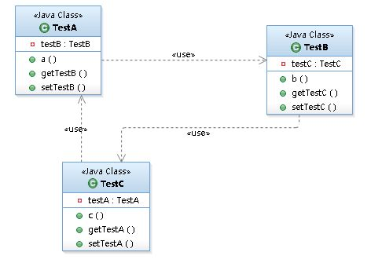

## bean的加载

```java
    protected <T> T doGetBean(
         String name, @Nullable Class<T> requiredType, @Nullable Object[] args, boolean typeCheckOnly)
         throws BeansException {
//    提取对应的beanName
      String beanName = transformedBeanName(name);
      Object bean;

//    检查缓存中或者实例工厂中是否有对应的实例
//    在创建单例bean的时候后存在依赖注入的情况，而在创建依赖的时候为了避免循环依赖，
//    Spring创建bean的原则是不等bean创建完成就会将创建bean的ObjectFactory提早曝光
//    也就是将ObjectFactory加入缓存，一旦下一个bean创建时候需要创建依赖上个bean则直接使用ObjectFactory
//    直接尝试从缓存获取或者singletonFactories中的ObjectFactory中获取
      // Eagerly check singleton cache for manually registered singletons.
      Object sharedInstance = getSingleton(beanName);
      if (sharedInstance != null && args == null) {
         if (logger.isTraceEnabled()) {
            if (isSingletonCurrentlyInCreation(beanName)) {
               logger.trace("Returning eagerly cached instance of singleton bean '" + beanName +
                     "' that is not fully initialized yet - a consequence of a circular reference");
            }
            else {
               logger.trace("Returning cached instance of singleton bean '" + beanName + "'");
            }
         }
//       返回对应的实例，有时候存在诸如BeanFactory的情况并不是直接返回实例本身而是返回指定方法返回的实例
         bean = getObjectForBeanInstance(sharedInstance, name, beanName, null);
      }

      else {

//       只有在单例情况下才会尝试解决循环依赖，原型模式情况下，如果存在
//       A中有B的属性，B中有A的属性，那么当依赖注入的时候，就会产生当A还未创建完的时候因为
//       对于B的创建再次返回创建A，造成循环依赖，也就是下面的情况
         // Fail if we're already creating this bean instance:
         // We're assumably within a circular reference.
         if (isPrototypeCurrentlyInCreation(beanName)) {
            throw new BeanCurrentlyInCreationException(beanName);
         }

         // Check if bean definition exists in this factory.
         BeanFactory parentBeanFactory = getParentBeanFactory();
//       如果beanDefinitionMap中也就是所有已经加载的类中不包括beanName则尝试从
//       parentBeanFactory中检测
         if (parentBeanFactory != null && !containsBeanDefinition(beanName)) {
            // Not found -> check parent.
            String nameToLookup = originalBeanName(name);
            if (parentBeanFactory instanceof AbstractBeanFactory) {
               return ((AbstractBeanFactory) parentBeanFactory).doGetBean(
                     nameToLookup, requiredType, args, typeCheckOnly);
            }
            else if (args != null) {
//             递归查找
               // Delegation to parent with explicit args.
               return (T) parentBeanFactory.getBean(nameToLookup, args);
            }
            else if (requiredType != null) {
               // No args -> delegate to standard getBean method.
               return parentBeanFactory.getBean(nameToLookup, requiredType);
            }
            else {
               return (T) parentBeanFactory.getBean(nameToLookup);
            }
         }

         if (!typeCheckOnly) {
            markBeanAsCreated(beanName);
         }

         try {
//          将存储XML配置文件的GernericBeanDefinition转换为RootBeanDefinition
            RootBeanDefinition mbd = getMergedLocalBeanDefinition(beanName);
            checkMergedBeanDefinition(mbd, beanName, args);

            // Guarantee initialization of beans that the current bean depends on.
            String[] dependsOn = mbd.getDependsOn();
//          若存在依赖则需要递归实例化依赖的bean
            if (dependsOn != null) {
               for (String dep : dependsOn) {
                  if (isDependent(beanName, dep)) {
                     throw new BeanCreationException(mbd.getResourceDescription(), beanName,
                           "Circular depends-on relationship between '" + beanName + "' and '" + dep + "'");
                  }
//                缓存依赖调用
                  registerDependentBean(dep, beanName);
                  try {
                     getBean(dep);
                  }
                  catch (NoSuchBeanDefinitionException ex) {
                     throw new BeanCreationException(mbd.getResourceDescription(), beanName,
                           "'" + beanName + "' depends on missing bean '" + dep + "'", ex);
                  }
               }
            }

//          实例化依赖的bean后便可以实例化mdb本身了
//          singleton模式的创建
            // Create bean instance.
            if (mbd.isSingleton()) {
               sharedInstance = getSingleton(beanName, () -> {
                  try {
                     return createBean(beanName, mbd, args);
                  }
                  catch (BeansException ex) {
                     // Explicitly remove instance from singleton cache: It might have been put there
                     // eagerly by the creation process, to allow for circular reference resolution.
                     // Also remove any beans that received a temporary reference to the bean.
                     destroySingleton(beanName);
                     throw ex;
                  }
               });
               bean = getObjectForBeanInstance(sharedInstance, name, beanName, mbd);
            }

            else if (mbd.isPrototype()) {
               // It's a prototype -> create a new instance.
               Object prototypeInstance = null;
               try {
                  beforePrototypeCreation(beanName);
                  prototypeInstance = createBean(beanName, mbd, args);
               }
               finally {
                  afterPrototypeCreation(beanName);
               }
               bean = getObjectForBeanInstance(prototypeInstance, name, beanName, mbd);
            }

            else {
//             指定的scope上实例化bean
               String scopeName = mbd.getScope();
               if (!StringUtils.hasLength(scopeName)) {
                  throw new IllegalStateException("No scope name defined for bean ´" + beanName + "'");
               }
               Scope scope = this.scopes.get(scopeName);
               if (scope == null) {
                  throw new IllegalStateException("No Scope registered for scope name '" + scopeName + "'");
               }
               try {
                  Object scopedInstance = scope.get(beanName, () -> {
                     beforePrototypeCreation(beanName);
                     try {
                        return createBean(beanName, mbd, args);
                     }
                     finally {
                        afterPrototypeCreation(beanName);
                     }
                  });
                  bean = getObjectForBeanInstance(scopedInstance, name, beanName, mbd);
               }
               catch (IllegalStateException ex) {
                  throw new ScopeNotActiveException(beanName, scopeName, ex);
               }
            }
         }
         catch (BeansException ex) {
            cleanupAfterBeanCreationFailure(beanName);
            throw ex;
         }
      }

      // Check if required type matches the type of the actual bean instance.
      if (requiredType != null && !requiredType.isInstance(bean)) {
         try {
            T convertedBean = getTypeConverter().convertIfNecessary(bean, requiredType);
            if (convertedBean == null) {
               throw new BeanNotOfRequiredTypeException(name, requiredType, bean.getClass());
            }
            return convertedBean;
         }
         catch (TypeMismatchException ex) {
            if (logger.isTraceEnabled()) {
               logger.trace("Failed to convert bean '" + name + "' to required type '" +
                     ClassUtils.getQualifiedName(requiredType) + "'", ex);
            }
            throw new BeanNotOfRequiredTypeException(name, requiredType, bean.getClass());
         }
      }
      return (T) bean;
   }
```

加载过程大致如下：

1.转换对应beanName

这里传入的name参数可能是别名，也可能是FactoryBean，所以需要进行一系列的解析，这些解析内容包括如下内容。

- 去除FactoryBean的修饰符，也就是如果name="&aa"，那么会首先去除&而使name="aa"。
- 取指定alias所表示的最终beanName，例如别名A指向名称为B的bean则返回B；若别名A指向别名B，别名B又指向名称为C的bean则返回C。

2.尝试从缓存中加载单例

单例在Spring的同一个容器内只会被创建一次，后续再获取bean，就直接从单例缓存中获取了。当然这里也只是尝试加载，首先尝试从缓存中加载，如果加载不成功则再次尝试从singletonFactories中加载。因为在创建单例bean的时候会存在依赖注入的情况，而在创建依赖的时候为了避免循环依赖，在Spring中创建bean的原则是不等bean创建完成就会将创建bean的ObjectFactory提早曝光加入到缓存中，一旦下一个bean创建时候需要依赖上一个bean则直接使用ObjectFactory。

3.bean的实例化

如果从缓存中得到了bean的原始状态，则需要对bean进行实例化。这里有必要强调一下，缓存中记录的只是最原始的bean状态，并不一定是我们最终想要的bean。举个例子，假如我们需要对工厂bean进行处理，那么这里得到的其实是工厂bean的初始状态，但是我们真正需要的是工厂bean中定义的factory-method方法中返回的bean，而getObjectForBeanInstance就是完成这个工作的。

4.原型模式的依赖检查

只有在单例情况下才会尝试解决循环依赖，如果存在A中有B的属性，B中有A的属性，那么当依赖注入的时候，就会产生当A还未创建完的时候因为对于B的创建再次返回创建A，造成循环依赖，也就是情况：isPrototypeCurrentlyInCreation(beanName)判断true。

5.检测parentBeanFactory

从代码上看，如果缓存没有数据的话直接转到父类工厂上去加载了，这是为什么呢？

可能读者忽略了一个很重要的判断条件：parentBeanFactory != null && !containsBean Definition (beanName)，parentBeanFactory != null。parentBeanFactory如果为空，则其他一切都是浮云，这个没什么说的，但是!containsBeanDefinition(beanName)就比较重要了，它是在检测如果当前加载的XML配置文件中不包含beanName所对应的配置，就只能到parentBeanFactory去尝试下了，然后再去递归的调用getBean方法。

6.将存储XML配置文件的GernericBeanDefinition转换为RootBeanDefinition

因为从XML配置文件中读取到的bean信息是存储在GernericBeanDefinition中的，但是所有的bean后续处理都是针对于RootBeanDefinition的，所以这里需要进行一个转换，转换的同时如果父类bean不为空的话，则会一并合并父类的属性。

7.寻找依赖

因为bean的初始化过程中很可能会用到某些属性，而某些属性很可能是动态配置的，并且配置成依赖于其他的bean，那么这个时候就有必要先加载依赖的bean，所以，在Spring的加载顺序中，在初始化某一个bean的时候首先会初始化这个bean所对应的依赖。

8.针对不同的scope进行bean的创建

Spring会根据不同的配置进行不同的初始化策略。

9.类型转换

程序到这里返回bean后已经基本结束了，通常对该方法的调用参数requiredType是为空的，但是可能会存在这样的情况，返回的bean其实是个String，但是requiredType却传入Integer类型，那么这时候本步骤就会起作用了，它的功能是将返回的bean转换为requiredType所指定的类型。当然，String转换为Integer是最简单的一种转换，在Spring中提供了各种各样的转换器，用户也可以自己扩展转换器来满足需求。


### FactoryBean的使用

一般情况下，Spring通过反射机制利用bean的class属性指定实现类来实例化bean 。在某些情况下，实例化bean过程比较复杂，如果按照传统的方式，则需要在\<bean>中提供大量的配置信息，配置方式的灵活性是受限的，这时采用编码的方式可能会得到一个简单的方案。Spring为此提供了一个*org.springframework.bean.factory.FactoryBean*的工厂类接口，用户可以通过实现该接口定制实例化bean的逻辑。

从Spring 3.0 开始， FactoryBean开始支持泛型，即接口声明改为FactoryBean\<T> 的形式：

```java
public interface FactoryBean<T> {  
   T getObject() throws Exception;  
   Class<?> getObjectType();  
   boolean isSingleton();  
}
```

- T getObject()：返回由FactoryBean创建的bean实例，如果isSingleton()返回true，则该实例会放到Spring容器中单实例缓存池中。
- boolean isSingleton()：返回由FactoryBean创建的bean实例的作用域是singleton还是prototype。
- Class\<T> getObjectType()：返回FactoryBean创建的bean类型。

当配置文件中\<bean>的class属性配置的实现类是FactoryBean时，通过 getBean()方法返回的不是FactoryBean本身，而是FactoryBean#getObject()方法所返回的对象，相当于FactoryBean#getObject()代理了getBean()方法。例如：如果使用传统方式配置下面Car的\<bean>时，Car的每个属性分别对应一个\<property>元素标签。

```java
 public   class  Car  {  
        private   int maxSpeed ;  
        private  String brand ;  
        private   double price ;  
       //get/set方法
}
```

如果用FactoryBean的方式实现就会灵活一些，下例通过逗号分割符的方式一次性地为Car的所有属性指定配置值：

```java
public   class  CarFactoryBean  implements  FactoryBean<Car>  {  
    private  String carInfo ;  
    public  Car getObject ()   throws  Exception  {  
        Car car =  new  Car () ;  
        String []  infos =  carInfo .split ( "," ) ;  
        car.setBrand ( infos [ 0 ]) ;  
        car.setMaxSpeed ( Integer. valueOf ( infos [ 1 ])) ;  
        car.setPrice ( Double. valueOf ( infos [ 2 ])) ;  
        return  car;  
    }  
    public  Class<Car> getObjectType ()   {  
        return  Car. class ;  
    }  
    public   boolean  isSingleton ()   {  
        return   false ;  
    }  
    public  String getCarInfo ()   {  
        return   this . carInfo ;  
    }  

    // 接受逗号分割符设置属性信息  
    public   void  setCarInfo ( String carInfo )   {  
        this . carInfo  = carInfo;  
    }  
}
```

有了这个CarFactoryBean后，就可以在配置文件中使用下面这种自定义的配置方式配置Car Bean了：

```xml
<bean id="car" class="com.test.factorybean.CarFactoryBean" carInfo="超级跑车,400,2000000"/>
```

当调用getBean("car") 时，Spring通过反射机制发现CarFactoryBean实现了FactoryBean的接口，这时Spring容器就调用接口方法CarFactoryBean#getObject()方法返回。如果希望获取CarFactoryBean的实例，则需要在使用getBean(beanName) 方法时在beanName前显示的加上 "&" 前缀，例如getBean("&car")。

### 缓存中获取单例bean

```java
public Object getSingleton(String beanName) {
   return getSingleton(beanName, true);
}
	protected Object getSingleton(String beanName, boolean allowEarlyReference) {
//		检查缓存中是否存在实例
		Object singletonObject = this.singletonObjects.get(beanName);
		if (singletonObject == null && isSingletonCurrentlyInCreation(beanName)) {
			synchronized (this.singletonObjects) {
//				如果此bean正在加载则不处理
				singletonObject = this.earlySingletonObjects.get(beanName);
				if (singletonObject == null && allowEarlyReference) {
					ObjectFactory<?> singletonFactory = this.singletonFactories.get(beanName);
					if (singletonFactory != null) {
						singletonObject = singletonFactory.getObject();
//						记录在缓存中，earlySingletonObjects和singletonFactories互斥
						this.earlySingletonObjects.put(beanName, singletonObject);
						this.singletonFactories.remove(beanName);
					}
				}
			}
		}
		return singletonObject;
	}

```

这个方法首先尝试从singletonObjects里面获取实例，如果获取不到再从earlySingletonObjects里面获取，如果还获取不到，再尝试从singletonFactories里面获取beanName对应的ObjectFactory，然后调用这个ObjectFactory的getObject来创建bean，并放到earlySingletonObjects里面去，并且从singletonFacotories里面remove掉这个ObjectFactory，而对于后续的所有内存操作都只为了循环依赖检测时候使用，也就是在allowEarlyReference为true的情况下才会使用。

这里涉及用于存储bean的不同的map，简单解释如下。

- singletonObjects：用于保存BeanName和创建bean实例之间的关系，bean name --> bean instance。
- singletonFactories：用于保存BeanName和创建bean的工厂之间的关系，bean name --> ObjectFactory。
- earlySingletonObjects：也是保存BeanName和创建bean实例之间的关系，与singletonObjects的不同之处在于，当一个单例bean被放到这里面后，那么当bean还在创建过程中，就可以通过getBean方法获取到了，其目的是用来检测循环引用。
- registeredSingletons：用来保存当前所有已注册的bean。

### 从bean的实例中获取对象

在getBean方法中，getObjectForBeanInstance是个高频率使用的方法，无论是从缓存中获得bean还是根据不同的scope策略加载bean。总之，我们得到bean的实例后要做的第一步就是调用这个方法来检测一下正确性，其实就是用于检测当前bean是否是FactoryBean类型的bean，如果是，那么需要调用该bean对应的FactoryBean实例中的getObject()作为返回值。

无论是从缓存中获取到的bean还是通过不同的scope策略加载的bean都只是最原始的bean状态，并不一定是我们最终想要的bean。举个例子，假如我们需要对工厂bean进行处理，那么这里得到的其实是工厂bean的初始状态，但是我们真正需要的是工厂bean中定义的factory-method方法中返回的bean，而getObjectForBeanInstance方法就是完成这个工作的。

```java
    protected Object getObjectForBeanInstance(
         Object beanInstance, String name, String beanName, @Nullable RootBeanDefinition mbd) {

      // Don't let calling code try to dereference the factory if the bean isn't a factory.
      if (BeanFactoryUtils.isFactoryDereference(name)) {
         if (beanInstance instanceof NullBean) {
            return beanInstance;
         }
         if (!(beanInstance instanceof FactoryBean)) {
            throw new BeanIsNotAFactoryException(beanName, beanInstance.getClass());
         }
         if (mbd != null) {
            mbd.isFactoryBean = true;
         }
         return beanInstance;
      }

      // Now we have the bean instance, which may be a normal bean or a FactoryBean.
      // If it's a FactoryBean, we use it to create a bean instance, unless the
      // caller actually wants a reference to the factory.
      if (!(beanInstance instanceof FactoryBean)) {
         return beanInstance;
      }

//    加载FactoryBean
      Object object = null;
      if (mbd != null) {
         mbd.isFactoryBean = true;
      }
      else {
//       尝试从缓存中加载bean
         object = getCachedObjectForFactoryBean(beanName);
      }
      if (object == null) {
         // Return bean instance from factory.
         FactoryBean<?> factory = (FactoryBean<?>) beanInstance;
         // Caches object obtained from FactoryBean if it is a singleton.
         if (mbd == null && containsBeanDefinition(beanName)) {
//          将存储XML配置文件的GenericBeanDefinition转换为RootBeanDefinition，如果指定BeanName
//          是子Bean的话同时后合并父类的相关属性
            mbd = getMergedLocalBeanDefinition(beanName);
         }
//       是否是用户定义的而不是应用程序本身定义的
         boolean synthetic = (mbd != null && mbd.isSynthetic());
         object = getObjectFromFactoryBean(factory, beanName, !synthetic);
      }
      return object;
   }
```

看看getObjectForBeanInstance中的所做的工作。

1．对FactoryBean正确性的验证。

2．对非FactoryBean不做任何处理。

3．对bean进行转换。

4．将从Factory中解析bean的工作委托给getObjectFromFactoryBean。

```java
    protected Object getObjectFromFactoryBean(FactoryBean<?> factory, String beanName, boolean shouldPostProcess) {
//    如果是单例模式
      if (factory.isSingleton() && containsSingleton(beanName)) {
         synchronized (getSingletonMutex()) {
            Object object = this.factoryBeanObjectCache.get(beanName);
            if (object == null) {
               object = doGetObjectFromFactoryBean(factory, beanName);
               // Only post-process and store if not put there already during getObject() call above
               // (e.g. because of circular reference processing triggered by custom getBean calls)
               Object alreadyThere = this.factoryBeanObjectCache.get(beanName);
               if (alreadyThere != null) {
                  object = alreadyThere;
               }
               else {
                  if (shouldPostProcess) {
                     if (isSingletonCurrentlyInCreation(beanName)) {
                        // Temporarily return non-post-processed object, not storing it yet..
                        return object;
                     }
                     beforeSingletonCreation(beanName);
                     try {
                        object = postProcessObjectFromFactoryBean(object, beanName);
                     }
                     catch (Throwable ex) {
                        throw new BeanCreationException(beanName,
                              "Post-processing of FactoryBean's singleton object failed", ex);
                     }
                     finally {
                        afterSingletonCreation(beanName);
                     }
                  }
                  if (containsSingleton(beanName)) {
                     this.factoryBeanObjectCache.put(beanName, object);
                  }
               }
            }
            return object;
         }
      }
      else {
         Object object = doGetObjectFromFactoryBean(factory, beanName);
         if (shouldPostProcess) {
            try {
               object = postProcessObjectFromFactoryBean(object, beanName);
            }
            catch (Throwable ex) {
               throw new BeanCreationException(beanName, "Post-processing of FactoryBean's object failed", ex);
            }
         }
         return object;
      }
   }
```

很遗憾，在这个代码中我们还是没有看到想要看到的代码，在这个方法里只做了一件事情，就是返回的bean如果是单例的，那就必须要保证全局唯一，同时，也因为是单例的，所以不必重复创建，可以使用缓存来提高性能，也就是说已经加载过就要记录下来以便于下次复用，否则的话就直接获取了。

在doGetObjectFromFactoryBean方法中我们终于看到了我们想要看到的方法，也就是object = factory.getObject()。

```java
    private Object doGetObjectFromFactoryBean(FactoryBean<?> factory, String beanName) throws BeanCreationException {
      Object object;
      try {
//       需要权限验证
         if (System.getSecurityManager() != null) {
            AccessControlContext acc = getAccessControlContext();
            try {
               object = AccessController.doPrivileged((PrivilegedExceptionAction<Object>) factory::getObject, acc);
            }
            catch (PrivilegedActionException pae) {
               throw pae.getException();
            }
         }
         else {
//          直接调用getObject方法
            object = factory.getObject();
         }
      }
      catch (FactoryBeanNotInitializedException ex) {
         throw new BeanCurrentlyInCreationException(beanName, ex.toString());
      }
      catch (Throwable ex) {
         throw new BeanCreationException(beanName, "FactoryBean threw exception on object creation", ex);
      }

      // Do not accept a null value for a FactoryBean that's not fully
      // initialized yet: Many FactoryBeans just return null then.
      if (object == null) {
         if (isSingletonCurrentlyInCreation(beanName)) {
            throw new BeanCurrentlyInCreationException(
                  beanName, "FactoryBean which is currently in creation returned null from getObject");
         }
         object = new NullBean();
      }
      return object;
   }
```

上面我们已经讲述了FactoryBean的调用方法，如果bean声明为FactoryBean类型，则当提取bean时提取的并不是FactoryBean，而是FactoryBean中对应的getObject方法返回的bean，而doGetObjectFromFactoryBean正是实现这个功能的。但是，我们看到在上面的方法中除了调用object = factory.getObject()得到我们想要的结果后并没有直接返回，而是接下来又做了些后处理的操作，这个又是做什么用的呢？于是我们跟踪进入AbstractAutowireCapableBeanFactory类的postProcessObjectFromFactoryBean方法：

```java
protected Object postProcessObjectFromFactoryBean(Object object, String beanName) {
   return applyBeanPostProcessorsAfterInitialization(object, beanName);
}
```

~~~java
	public Object applyBeanPostProcessorsAfterInitialization(Object existingBean, String beanName)
			throws BeansException {

		Object result = existingBean;
		for (BeanPostProcessor processor : getBeanPostProcessors()) {
			Object current = processor.postProcessAfterInitialization(result, beanName);
			if (current == null) {
				return result;
			}
			result = current;
		}
		return result;
	}
~~~

尽可能保证所有bean初始化后都会调用注册的BeanPostProcessor的postProcessAfterInitialization方法进行处理，在实际开发过程中大可以针对此特性设计自己的业务逻辑。

### 获取单例

如果缓存中不存在已经加载的单例bean就需要从头开始bean的加载过程了，而Spring中使用getSingleton的重载方法实现bean的加载过程。

```java
    public Object getSingleton(String beanName, ObjectFactory<?> singletonFactory) {
      Assert.notNull(beanName, "Bean name must not be null");
      synchronized (this.singletonObjects) {
//       首先检查对应的bean是否已经加载过
         Object singletonObject = this.singletonObjects.get(beanName);
         if (singletonObject == null) {
            if (this.singletonsCurrentlyInDestruction) {
               throw new BeanCreationNotAllowedException(beanName,
                     "Singleton bean creation not allowed while singletons of this factory are in destruction " +
                     "(Do not request a bean from a BeanFactory in a destroy method implementation!)");
            }
            if (logger.isDebugEnabled()) {
               logger.debug("Creating shared instance of singleton bean '" + beanName + "'");
            }
            beforeSingletonCreation(beanName);
            boolean newSingleton = false;
            boolean recordSuppressedExceptions = (this.suppressedExceptions == null);
            if (recordSuppressedExceptions) {
               this.suppressedExceptions = new LinkedHashSet<>();
            }
            try {
//             初始化bean
               singletonObject = singletonFactory.getObject();
               newSingleton = true;
            }
            catch (IllegalStateException ex) {
               // Has the singleton object implicitly appeared in the meantime ->
               // if yes, proceed with it since the exception indicates that state.
               singletonObject = this.singletonObjects.get(beanName);
               if (singletonObject == null) {
                  throw ex;
               }
            }
            catch (BeanCreationException ex) {
               if (recordSuppressedExceptions) {
                  for (Exception suppressedException : this.suppressedExceptions) {
                     ex.addRelatedCause(suppressedException);
                  }
               }
               throw ex;
            }
            finally {
               if (recordSuppressedExceptions) {
                  this.suppressedExceptions = null;
               }
               afterSingletonCreation(beanName);
            }
            if (newSingleton) {
//             加入缓存
               addSingleton(beanName, singletonObject);
            }
         }
         return singletonObject;
      }
   }
```

真正的获取单例bean的方法其实并不是在此方法中实现的，其实现逻辑是在ObjectFactory类型的实例singletonFactory中实现的。而这些准备及处理操作包括如下内容。

1．检查缓存是否已经加载过。

2．若没有加载，则记录beanName的正在加载状态。

3．加载单例前记录加载状态。

beforeSingletonCreation函数中做了一个很重要的操作：记录加载状态，也就是通过this.singletonsCurrentlyInCreation.add(beanName)将当前正要创建的bean记录在缓存中，这样便可以对循环依赖进行检测。

```java
protected void beforeSingletonCreation(String beanName) {
   if (!this.inCreationCheckExclusions.contains(beanName) && !this.singletonsCurrentlyInCreation.add(beanName)) {
      throw new BeanCurrentlyInCreationException(beanName);
   }
}
```

4．通过调用参数传入的ObjectFactory的个体Object方法实例化bean。

5．加载单例后的处理方法调用。

同步骤3的记录加载状态相似，当bean加载结束后需要移除缓存中对该bean的正在加载状态的记录。

```java
protected void afterSingletonCreation(String beanName) {
   if (!this.inCreationCheckExclusions.contains(beanName) && !this.singletonsCurrentlyInCreation.remove(beanName)) {
      throw new IllegalStateException("Singleton '" + beanName + "' isn't currently in creation");
   }
}
```

6．将结果记录至缓存并删除加载bean过程中所记录的各种辅助状态。

```java
protected void addSingleton(String beanName, Object singletonObject) {
   synchronized (this.singletonObjects) {
      this.singletonObjects.put(beanName, singletonObject);
      this.singletonFactories.remove(beanName);
      this.earlySingletonObjects.remove(beanName);
      this.registeredSingletons.add(beanName);
   }
}
```

7．返回处理结果。

虽然我们已经从外部了解了加载bean的逻辑架构，但现在我们还并没有开始对bean加载功能的探索，之前提到过，bean的加载逻辑其实是在传入的ObjectFactory类型的参数singletonFactory中定义的，我们反推参数的获取，得到如下代码：

```java
sharedInstance = getSingleton(beanName, new ObjectFactory<Object>() {
    public Object getObject() throws BeansException {
        try {
            return createBean(beanName, mbd, args);
        }
        catch (BeansException ex) {
            destroySingleton(beanName);
            throw ex;
        }
    }
});
```

### 准备创建bean

一个真正干活的函数其实是以do开头的，比如doGetObjectFromFactoryBean；而给我们错觉的函数，比如getObjectFromFactoryBean，其实只是从全局角度去做些统筹的工作。这个规则对于createBean也不例外，那么让我们看看在createBean函数中做了哪些准备工作。

~~~java
@Override
protected Object createBean(String beanName, RootBeanDefinition mbd, @Nullable Object[] args)
   throws BeanCreationException {

  if (logger.isTraceEnabled()) {
   logger.trace("Creating instance of bean '" + beanName + "'");
  }
  RootBeanDefinition mbdToUse = mbd;

  // Make sure bean class is actually resolved at this point, and
  // clone the bean definition in case of a dynamically resolved Class
  // which cannot be stored in the shared merged bean definition.
  Class<?> resolvedClass = resolveBeanClass(mbd, beanName);
  if (resolvedClass != null && !mbd.hasBeanClass() && mbd.getBeanClassName() != null) {
   mbdToUse = new RootBeanDefinition(mbd);
   mbdToUse.setBeanClass(resolvedClass);
  }

  // Prepare method overrides.
  try {
   mbdToUse.prepareMethodOverrides();
  }
  catch (BeanDefinitionValidationException ex) {
   throw new BeanDefinitionStoreException(mbdToUse.getResourceDescription(),
      beanName, "Validation of method overrides failed", ex);
  }

  try {
   // Give BeanPostProcessors a chance to return a proxy instead of the target bean instance.
   Object bean = resolveBeforeInstantiation(beanName, mbdToUse);
   if (bean != null) {
     return bean;
   }
  }
  catch (Throwable ex) {
   throw new BeanCreationException(mbdToUse.getResourceDescription(), beanName,
      "BeanPostProcessor before instantiation of bean failed", ex);
  }

  try {
   Object beanInstance = doCreateBean(beanName, mbdToUse, args);
   if (logger.isTraceEnabled()) {
     logger.trace("Finished creating instance of bean '" + beanName + "'");
   }
   return beanInstance;
  }
  catch (BeanCreationException | ImplicitlyAppearedSingletonException ex) {
   // A previously detected exception with proper bean creation context already,
   // or illegal singleton state to be communicated up to DefaultSingletonBeanRegistry.
   throw ex;
  }
  catch (Throwable ex) {
   throw new BeanCreationException(
      mbdToUse.getResourceDescription(), beanName, "Unexpected exception during bean creation", ex);
  }
}
~~~

从代码中我们可以总结出函数完成的具体步骤及功能。

1．根据设置的class属性或者根据className来解析Class。

2．对override属性进行标记及验证。

Spring配置中存在lookup-method和replace-method的，而这两个配置的加载其实就是将配置统一存放在BeanDefinition中的methodOverrides属性里，而这个函数的操作其实也就是针对于这两个配置的.

3．应用初始化前的后处理器，解析指定bean是否存在初始化前的短路操作。

4．创建bean。

我们首先查看下对override属性标记及验证的逻辑实现。

#### 处理override属性

查看源码中AbstractBeanDefinition类的prepareMethodOverrides方法

```java
public void prepareMethodOverrides() throws BeanDefinitionValidationException {
   // Check that lookup methods exist and determine their overloaded status.
   if (hasMethodOverrides()) {
      getMethodOverrides().getOverrides().forEach(this::prepareMethodOverride);
   }
}
	protected void prepareMethodOverride(MethodOverride mo) throws BeanDefinitionValidationException {
//		获取对应类中对应方法名的个数
		int count = ClassUtils.getMethodCountForName(getBeanClass(), mo.getMethodName());
		if (count == 0) {
			throw new BeanDefinitionValidationException(
					"Invalid method override: no method with name '" + mo.getMethodName() +
					"' on class [" + getBeanClassName() + "]");
		}
		else if (count == 1) {
			// Mark override as not overloaded, to avoid the overhead of arg type checking.
			mo.setOverloaded(false);
		}
	}
```

Spring配置中存在lookup-method和replace-method两个配置功能，而这两个配置的加载其实就是将配置统一存放在BeanDefinition中的methodOverrides属性里，这两个功能实现原理其实是在bean实例化的时候如果检测到存在methodOverrides属性，会动态地为当前bean生成代理并使用对应的拦截器为bean做增强处理。

#### 实例化的前置处理

在真正调用doCreate方法创建bean的实例前使用了这样一个方法resolveBeforeInstantiation (beanName, mbd)对BeanDefinigiton中的属性做些前置处理。当然，无论其中是否有相应的逻辑实现我们都可以理解，因为真正逻辑实现前后留有处理函数也是可扩展的一种体现，但是，这并不是最重要的，在函数中还提供了一个短路判断，这才是最为关键的部分。

```java
if (bean != null) {
         return bean;
}
```

当经过前置处理后返回的结果如果不为空，那么会直接略过后续的bean的创建而直接返回结果。这一特性虽然很容易被忽略，但是却起着至关重要的作用，我们熟知的AOP功能就是基于这里的判断的。

```java
    protected Object resolveBeforeInstantiation(String beanName, RootBeanDefinition mbd) {
      Object bean = null;
//    如果尚未被解析
      if (!Boolean.FALSE.equals(mbd.beforeInstantiationResolved)) {
         // Make sure bean class is actually resolved at this point.
         if (!mbd.isSynthetic() && hasInstantiationAwareBeanPostProcessors()) {
            Class<?> targetType = determineTargetType(beanName, mbd);
            if (targetType != null) {
               bean = applyBeanPostProcessorsBeforeInstantiation(targetType, beanName);
               if (bean != null) {
                  bean = applyBeanPostProcessorsAfterInitialization(bean, beanName);
               }
            }
         }
         mbd.beforeInstantiationResolved = (bean != null);
      }
      return bean;
   }
```

此方法中最吸引我们的无疑是两个方法applyBeanPostProcessorsBeforeInstantiation以及applyBeanPostProcessorsAfterInitialization。两个方法实现的非常简单，无非是对后处理器中的所有InstantiationAwareBeanPostProcessor类型的后处理器进行postProcessBeforeInstantiation方法和BeanPostProcessor的postProcessAfterInitialization方法的调用。

1.实例化前的后处理器应用

bean的实例化前调用，也就是将AbsractBeanDefinition转换为BeanWrapper前的处理。给子类一个修改BeanDefinition的机会，也就是说当程序经过这个方法后，bean可能已经不是我们认为的bean了，而是或许成为了一个经过处理的代理bean，可能是通过cglib生成的，也可能是通过其他技术生成的。我们只需要知道，在bean的实例化前会调用后处理器的方法进行处理。

```java
protected Object applyBeanPostProcessorsBeforeInstantiation(Class<?> beanClass, String beanName) {
   for (InstantiationAwareBeanPostProcessor bp : getBeanPostProcessorCache().instantiationAware) {
      Object result = bp.postProcessBeforeInstantiation(beanClass, beanName);
      if (result != null) {
         return result;
      }
   }
   return null;
}
```

2.实例化后的后处理器应用

Spring中的规则是在bean的初始化后尽可能保证将注册的后处理器的postProcessAfterInitialization方法应用到该bean中，因为如果返回的bean不为空，那么便不会再次经历普通bean的创建过程，所以只能在这里应用后处理器的postProcessAfterInitialization方法。

```java
public Object applyBeanPostProcessorsAfterInitialization(Object existingBean, String beanName)
      throws BeansException {

   Object result = existingBean;
   for (BeanPostProcessor processor : getBeanPostProcessors()) {
      Object current = processor.postProcessAfterInitialization(result, beanName);
      if (current == null) {
         return result;
      }
      result = current;
   }
   return result;
}
```

### 循环依赖

循环依赖就是循环引用，就是两个或多个bean相互之间的持有对方，比如CircleA引用CircleB，CircleB引用CircleC，CircleC引用CircleA，则它们最终反映为一个环。此处不是循环调用，循环调用是方法之间的环调用，如图所示。



代码：

```java
public class CircleA {
   private CircleB circleB;

    	public CircleA(CircleB circleB) {
		this.circleB = circleB;
	}
    
   public void a(){
      this.circleB.b();
   }

   public CircleB getCircleB() {
      return circleB;
   }

   public void setCircleB(CircleB circleB) {
      this.circleB = circleB;
   }
}
//省略构造器 d
public class CircleB {
	private CircleC circleC;

	public CircleC getCircleC() {
		return circleC;
	}

	public void setCircleC(CircleC circleC) {
		this.circleC = circleC;
	}

	public void b() {
		this.circleC.c();
	}
}
public class CircleC {
	private CircleA circleA;

	public void c() {
		this.circleA.a();
	}

	public CircleA getCircleA() {
		return circleA;
	}

	public void setCircleA(CircleA circleA) {
		this.circleA = circleA;
	}
}

```

circle.xml

~~~xml
	<bean id="circleA" class="top.hellooooo.sourcecode.charpter05.bean.CircleA">
		<constructor-arg index="0" ref="circleB"/>
	</bean>
	<bean id="circleB" class="top.hellooooo.sourcecode.charpter05.bean.CircleB">
		<constructor-arg index="0" ref="circleC"/>
	</bean>
	<bean id="circleC" class="top.hellooooo.sourcecode.charpter05.bean.CircleC">
		<constructor-arg ref="circleA" index="0"/>
	</bean>
~~~

测试用例：

```java
ApplicationContext applicationContext = new ClassPathXmlApplicationContext("circle.xml");
```

针对以上代码的分析如下。

- Spring容器创建“circleA”bean，首先去“当前创建bean池”查找是否当前bean正在创建，如果没发现，则继续准备其需要的构造器参数“circleB”，并将“circleA”标识符放到“当前创建bean池”。
- Spring容器创建“circleB”bean，首先去“当前创建bean池”查找是否当前bean正在创建，如果没发现，则继续准备其需要的构造器参数“circleC”，并将“circleB”标识符放到“当前创建bean池”。
- Spring容器创建“circleC”bean，首先去“当前创建bean池”查找是否当前bean正在创建，如果没发现，则继续准备其需要的构造器参数“circleA”，并将“circleC”标识符放到“当前创建bean池”。
- 到此为止Spring容器要去创建“circleA”bean，发现该bean标识符在“当前创建bean池”中，因为表示循环依赖，抛出BeanCurrentlyInCreationException。

~~~
nested exception is org.springframework.beans.factory.BeanCurrentlyInCreationException: Error creating bean with name 'circleA': Requested bean is currently in creation: Is there an unresolvable circular reference?
~~~

2.setter循环依赖

表示通过setter注入方式构成的循环依赖。对于setter注入造成的依赖是通过Spring容器提前暴露刚完成构造器注入但未完成其他步骤（如setter注入）的bean来完成的，而且只能解决单例作用域的bean循环依赖。通过提前暴露一个单例工厂方法，从而使其他bean能引用到该bean，如下代码所示:

```java
addSingletonFactory(beanName, new ObjectFactory() {   
    public Object getObject() throws BeansException {   
        return getEarlyBeanReference(beanName, mbd, bean);   
    }   
});
```

具体步骤如下。

1．Spring容器创建单例“circleA”bean，首先根据无参构造器创建bean，并暴露一个“ObjectFactory”用于返回一个提前暴露一个创建中的bean，并将“circleA”标识符放到“当前创建bean池”，然后进行setter注入“circleB”。

2．Spring容器创建单例“circleB”bean，首先根据无参构造器创建bean，并暴露一个“ObjectFactory”用于返回一个提前暴露一个创建中的bean，并将“circleB”标识符放到“当前创建bean池”，然后进行setter注入“circleC”。

3．Spring容器创建单例“circleC”bean，首先根据无参构造器创建bean，并暴露一个“ObjectFactory”用于返回一个提前暴露一个创建中的bean，并将“circleC”标识符放到“当前创建bean池”，然后进行setter注入“circleA”。进行注入“circleA”时由于提前暴露了“ObjectFactory”工厂，从而使用它返回提前暴露一个创建中的bean。

4．最后在依赖注入“circleB”和“circleA”，完成setter注入。

3.prototype范围的依赖处理

对于“prototype”作用域bean，Spring容器无法完成依赖注入，因为Spring容器不进行缓存“prototype”作用域的bean，因此无法提前暴露一个创建中的bean。示例如下：

~~~xml
	<bean id="circleA" class="top.hellooooo.sourcecode.charpter05.bean.CircleA" scope="prototype">
		<constructor-arg index="0" ref="circleB"/>
	</bean>
	<bean id="circleB" class="top.hellooooo.sourcecode.charpter05.bean.CircleB" scope="prototype">
		<constructor-arg index="0" ref="circleC"/>
	</bean>
	<bean id="circleC" class="top.hellooooo.sourcecode.charpter05.bean.CircleC" scope="prototype">
		<constructor-arg ref="circleA" index="0"/>
	</bean>
~~~

### 创建bean

当经历过resolveBeforeInstantiation方法后，程序有两个选择，如果创建了代理或者说重写了InstantiationAwareBeanPostProcessor的postProcessBeforeInstantiation方法并在方法postProcessBeforeInstantiation中改变了bean，则直接返回就可以了，否则需要进行常规bean的创建。而这常规bean的创建就是在doCreateBean中完成的。

``` java
    protected Object doCreateBean(String beanName, RootBeanDefinition mbd, @Nullable Object[] args)
         throws BeanCreationException {

      // Instantiate the bean.
      BeanWrapper instanceWrapper = null;
      if (mbd.isSingleton()) {
         instanceWrapper = this.factoryBeanInstanceCache.remove(beanName);
      }
      if (instanceWrapper == null) {
//       根据指定bean使用对应的策略创建新的示例，如：工厂方法、构造函数自动注入、简单初始化
         instanceWrapper = createBeanInstance(beanName, mbd, args);
      }
      Object bean = instanceWrapper.getWrappedInstance();
      Class<?> beanType = instanceWrapper.getWrappedClass();
      if (beanType != NullBean.class) {
         mbd.resolvedTargetType = beanType;
      }

      // Allow post-processors to modify the merged bean definition.
      synchronized (mbd.postProcessingLock) {
         if (!mbd.postProcessed) {
//          应用MergedBeanDefinitionPostProcessor
            try {
               applyMergedBeanDefinitionPostProcessors(mbd, beanType, beanName);
            }
            catch (Throwable ex) {
               throw new BeanCreationException(mbd.getResourceDescription(), beanName,
                     "Post-processing of merged bean definition failed", ex);
            }
            mbd.postProcessed = true;
         }
      }

      // Eagerly cache singletons to be able to resolve circular references
      // even when triggered by lifecycle interfaces like BeanFactoryAware.
//    是否需要提早曝光：单例&允许循环依赖&当前bean正在创建中，检测循环依赖
      boolean earlySingletonExposure = (mbd.isSingleton() && this.allowCircularReferences &&
            isSingletonCurrentlyInCreation(beanName));
      if (earlySingletonExposure) {
         if (logger.isTraceEnabled()) {
            logger.trace("Eagerly caching bean '" + beanName +
                  "' to allow for resolving potential circular references");
         }
//       为避免后期循环依赖，可以在bean初始化完成前创建实例的ObjectFactory加入工厂
//       AOP在这里将advice动态织入bean中，没有则直接返回bean，不做任何处理
         addSingletonFactory(beanName, () -> getEarlyBeanReference(beanName, mbd, bean));
      }

      // Initialize the bean instance.
      Object exposedObject = bean;
      try {
//       对bean进行填充，将各个属性值注入，其中，可能存在依赖于其他bean的属性，则会递归初始化依赖bean
         populateBean(beanName, mbd, instanceWrapper);
         exposedObject = initializeBean(beanName, exposedObject, mbd);
      }
      catch (Throwable ex) {
         if (ex instanceof BeanCreationException && beanName.equals(((BeanCreationException) ex).getBeanName())) {
            throw (BeanCreationException) ex;
         }
         else {
            throw new BeanCreationException(
                  mbd.getResourceDescription(), beanName, "Initialization of bean failed", ex);
         }
      }

      if (earlySingletonExposure) {
         Object earlySingletonReference = getSingleton(beanName, false);
         if (earlySingletonReference != null) {
//          如果exposedObject没有在初始化方法中被改变，也就是没有被增强
            if (exposedObject == bean) {
               exposedObject = earlySingletonReference;
            }
            else if (!this.allowRawInjectionDespiteWrapping && hasDependentBean(beanName)) {
               String[] dependentBeans = getDependentBeans(beanName);
               Set<String> actualDependentBeans = new LinkedHashSet<>(dependentBeans.length);
               for (String dependentBean : dependentBeans) {
//                检测依赖
                  if (!removeSingletonIfCreatedForTypeCheckOnly(dependentBean)) {
                     actualDependentBeans.add(dependentBean);
                  }
               }
//             因为bean创建后其锁依赖的bean一定是已经创建的，actualDependentBeans部位空则表示当前bean创建后其
//             依赖的bean却没有全部创建完，也就是说存在循环依赖
               if (!actualDependentBeans.isEmpty()) {
                  throw new BeanCurrentlyInCreationException(beanName,
                        "Bean with name '" + beanName + "' has been injected into other beans [" +
                        StringUtils.collectionToCommaDelimitedString(actualDependentBeans) +
                        "] in its raw version as part of a circular reference, but has eventually been " +
                        "wrapped. This means that said other beans do not use the final version of the " +
                        "bean. This is often the result of over-eager type matching - consider using " +
                        "'getBeanNamesForType' with the 'allowEagerInit' flag turned off, for example.");
               }
            }
         }
      }

      // Register bean as disposable.
      try {
//       根据scope注册bean
         registerDisposableBeanIfNecessary(beanName, bean, mbd);
      }
      catch (BeanDefinitionValidationException ex) {
         throw new BeanCreationException(
               mbd.getResourceDescription(), beanName, "Invalid destruction signature", ex);
      }

      return exposedObject;
   }
```

尽管日志与异常的内容非常重要，但是在阅读源码的时候似乎大部分人都会直接忽略掉。在此不深入探讨日志及异常的设计，我们看看整个函数的概要思路。

1．如果是单例则需要首先清除缓存。

2．实例化bean，将BeanDefinition转换为BeanWrapper。

转换是一个复杂的过程，但是我们可以尝试概括大致的功能，如下所示。

- 如果存在工厂方法则使用工厂方法进行初始化。
- 一个类有多个构造函数，每个构造函数都有不同的参数，所以需要根据参数锁定构造函数并进行初始化。
- 如果既不存在工厂方法也不存在带有参数的构造函数，则使用默认的构造函数进行bean的实例化。

3．MergedBeanDefinitionPostProcessor的应用。

bean合并后的处理，Autowired注解正是通过此方法实现诸如类型的预解析。

4．依赖处理。

在Spring中会有循环依赖的情况，例如，当A中含有B的属性，而B中又含有A的属性时就会构成一个循环依赖，此时如果A和B都是单例，那么在Spring中的处理方式就是当创建B的时候，涉及自动注入A的步骤时，并不是直接去再次创建A，而是通过放入缓存中的ObjectFactory来创建实例，这样就解决了循环依赖的问题。

5．属性填充。将所有属性填充至bean的实例中。

6．循环依赖检查。

之前有提到过，在Sping中解决循环依赖只对单例有效，而对于prototype的bean，Spring没有好的解决办法，唯一要做的就是抛出异常。在这个步骤里面会检测已经加载的bean是否已经出现了依赖循环，并判断是否需要抛出异常。

7．注册DisposableBean。

如果配置了destroy-method，这里需要注册以便于在销毁时候调用。

8．完成创建并返回。

可以看到上面的步骤非常的繁琐，每一步骤都使用了大量的代码来完成其功能，最复杂也是最难以理解的当属循环依赖的处理，在真正进入doCreateBean前我们有必要先了解下循环依赖。

#### 创建bean的实例

当我们了解了循环依赖以后就可以深入分析创建bean的每一个步骤了，首先我们从createBeanInstance开始。

```java
    protected BeanWrapper createBeanInstance(String beanName, RootBeanDefinition mbd, @Nullable Object[] args) {
//    解析class
      // Make sure bean class is actually resolved at this point.
      Class<?> beanClass = resolveBeanClass(mbd, beanName);

      if (beanClass != null && !Modifier.isPublic(beanClass.getModifiers()) && !mbd.isNonPublicAccessAllowed()) {
         throw new BeanCreationException(mbd.getResourceDescription(), beanName,
               "Bean class isn't public, and non-public access not allowed: " + beanClass.getName());
      }

      Supplier<?> instanceSupplier = mbd.getInstanceSupplier();
      if (instanceSupplier != null) {
         return obtainFromSupplier(instanceSupplier, beanName);
      }

//    如果工厂方法不为空则使用工厂方法初始化策略
      if (mbd.getFactoryMethodName() != null) {
         return instantiateUsingFactoryMethod(beanName, mbd, args);
      }

      // Shortcut when re-creating the same bean...
      boolean resolved = false;
      boolean autowireNecessary = false;
      if (args == null) {
//       一个类有多个构造函数，每个构造函数都有不同的参数，所以
//       调用前需要现根据参数锁定构造函数或对应的工厂方法
         synchronized (mbd.constructorArgumentLock) {
            if (mbd.resolvedConstructorOrFactoryMethod != null) {
               resolved = true;
               autowireNecessary = mbd.constructorArgumentsResolved;
            }
         }
      }
//    如果已经解析过则使用解析好的构造函数方法不需要再次锁定
      if (resolved) {
         if (autowireNecessary) {
//          构造函数自动注入
            return autowireConstructor(beanName, mbd, null, null);
         }
         else {
//          使用默认构造函数构造
            return instantiateBean(beanName, mbd);
         }
      }

//    根据参数解析构造函数
      // Candidate constructors for autowiring?
      Constructor<?>[] ctors = determineConstructorsFromBeanPostProcessors(beanClass, beanName);
      if (ctors != null || mbd.getResolvedAutowireMode() == AUTOWIRE_CONSTRUCTOR ||
            mbd.hasConstructorArgumentValues() || !ObjectUtils.isEmpty(args)) {
         return autowireConstructor(beanName, mbd, ctors, args);
      }

      // Preferred constructors for default construction?
      ctors = mbd.getPreferredConstructors();
      if (ctors != null) {
         return autowireConstructor(beanName, mbd, ctors, null);
      }

      // No special handling: simply use no-arg constructor.
      return instantiateBean(beanName, mbd);
   }
```

虽然代码中实例化的细节非常复杂，但是在createBeanInstance方法中我们还是可以清晰地看到实例化的逻辑的。

1．如果在RootBeanDefinition中存在factoryMethodName属性，或者说在配置文件中配置了factory-method，那么Spring会尝试使用instantiateUsingFactoryMethod(beanName, mbd, args)方法根据RootBeanDefinition中的配置生成bean的实例。

2．解析构造函数并进行构造函数的实例化。因为一个bean对应的类中可能会有多个构造函数，而每个构造函数的参数不同，Spring在根据参数及类型去判断最终会使用哪个构造函数进行实例化。但是，判断的过程是个比较消耗性能的步骤，所以采用缓存机制，如果已经解析过则不需要重复解析而是直接从RootBeanDefinition中的属性resolvedConstructorOrFactoryMethod缓存的值去取，否则需要再次解析，并将解析的结果添加至RootBeanDefinition中的属性resolvedConstructorOrFactoryMethod中。

1.autowireConstructor

